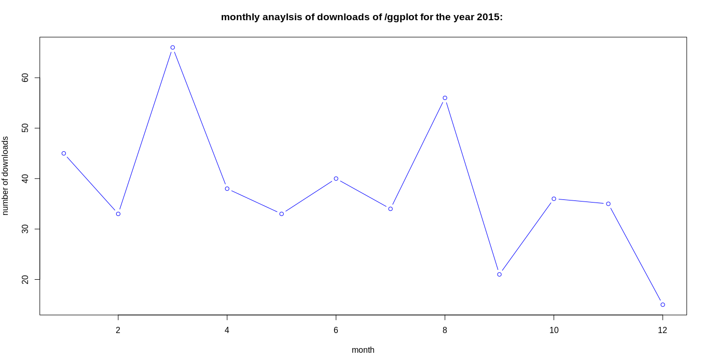
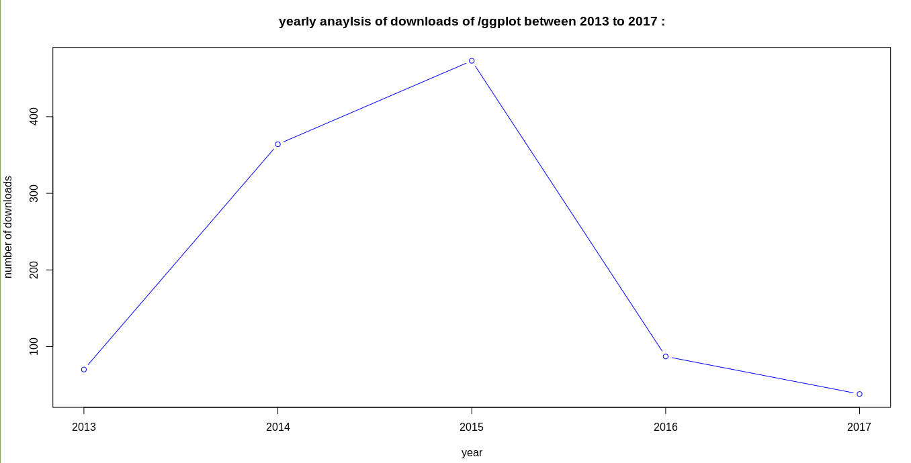
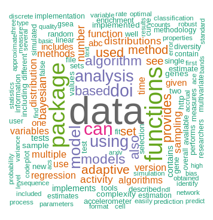
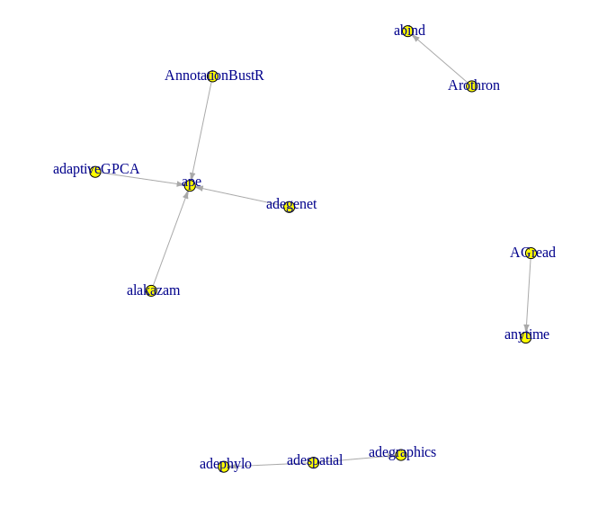
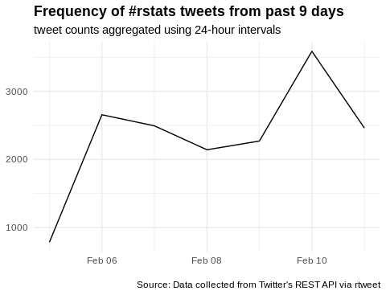
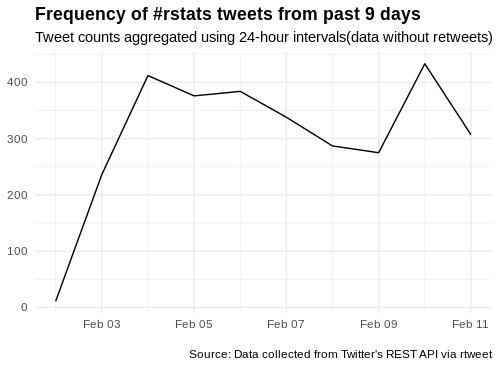

# rcEXP
The scripts to perform R community exploration

The exploration has been performed at three platforms,namely

CRAN exploration(Current status):

The data of all the packages of CRAN is stored in a dataframe and the data is tidied by removing the rows without a package name or a date(The filtering criteria can be modified according to the requirements).

The daily,monthly,yearly downloads and top50 downloaded packages can be easily obtained.The results can be visualized using frequnecy plots.

The monthly download analysis of ggplot for the year 2015 is shown below : 

The yearly download analysis of ggplot between 2013 to 2017 is shown below : 

The popular packages(assuming it to be same as the trending packages), popular authors, most active authors can also be obtained.

A word cloud of the most common words used in the description of the packages can also be obtained.
A word cloud obtained by scraping a sample of 1000 packages can be seen below :

A dependency network graph can also be obtained for the packages.
A dependency netwrok created by using a sample of 500 packages can be seen below:

 

Twitter exploration:

The information about #rstats tweets including and excluding retweets is stored and filtered.

The frequency plot of tweets containing #rstats including retweets is shown below.

The frequency plot of tweets containing #rstats excluding retweets is shown below.

and

Github exploration:

The search functionality has been added which searches through R repositories from github.
The searches have been sorted based on the number of stars.
The most starred repositories can also be obtained.

NOTE : All the plots above have been generated by running the scripts in the repository 
